## {#title-slide data-menu-title="Title" style="text-align: center; display: flex; flex-direction: column; justify-content: center; height: 100%;"}

### Machine Learning-Based Anchor-Aware Conditional Flow Matching for RF Localization in Wireless Capsule Endoscopy

*EuCAP 2026*

**Subramaniam S. Murugesan**$^1$, Muhammad Qamar$^1$, Kamil Yavuz Kapusuz$^2$, Mohamed A. Thaha$^{3,4}$, Akram Alomainy$^1$

::: {style="font-size: 0.6em; margin-top: 0.5em;"}
$^1$Queen Mary University of London | $^2$Ghent University/imec | $^3$Royal London Hospital, Barts Health NHS Trust | $^4$Blizard Institute, QMUL
:::

## Motivation: Why Localize a Wireless Capsule? {.smaller}

:::: {.columns}

::: {.column width="55%"}

### The Clinical Need

- Wireless capsule endoscopy (WCE) enables **non-invasive visualization** of the GI tract
- Detected abnormalities must be **mapped to anatomical regions** for clinical decision-making
- **RF-based localization** is attractive: non-ionizing, no line-of-sight required, wearable-compatible

### The Challenge

- **Multipath propagation** through heterogeneous tissue
- **Patient-specific anatomical variations** in body size and composition
- **Orientation-dependent radiation patterns** from capsule antenna
- **Anchor calibration errors** from body-worn sensor placement

:::

::: {.column width="45%"}

::: {style="text-align: center; margin-bottom: 0.5em;"}
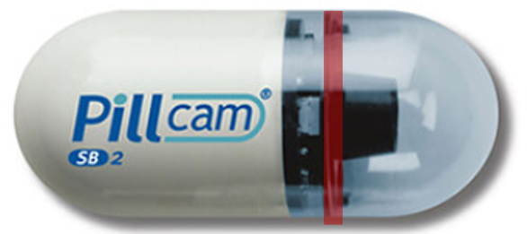

PillCam — 11 mm × 27 mm clinical capsule

:::

Wearable multi-anchor setup: 9 antennas on 3 rings

:::

::::

::: {.callout-note}
## Our Contribution
An **anchor-aware conditional flow matching** framework that learns a geometry-constrained transport process for single-shot, uncertainty-aware 3D localization from RF measurements alone.
:::

---

## Prior Work and Positioning {.smaller}

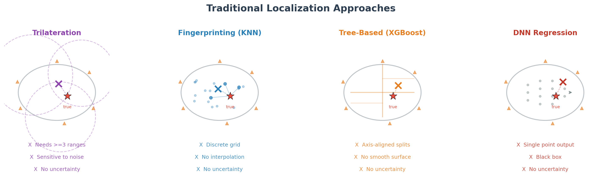{width="100%" fig-align="center"}

---

## Our Approach: Conditional Flow Matching {.smaller}

:::: {.columns}

::: {.column width="58%"}

::: {style="text-align: center;"}

:::

::: {style="text-align: center; font-size: 0.7em; color: #555; margin-top: -0.3em;"}
Particles flow from prior (scattered) to posterior (concentrated) — spread encodes uncertainty
:::

::: {style="text-align: center; margin-top: 0.4em;"}
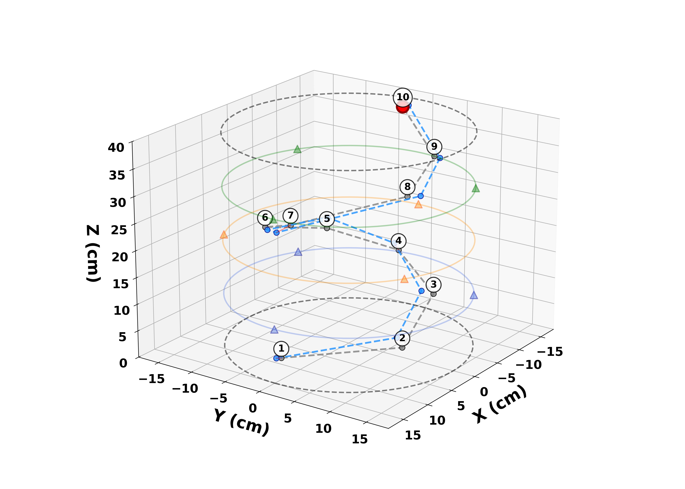
:::

::: {style="text-align: center; font-size: 0.7em; color: #555; margin-top: -0.3em;"}
3D trajectory through phantom — ground truth (gray) vs predicted (blue)
:::

:::

::: {.column width="42%"}

### Velocity field, conditioned on RF $\mathbf{y}$

$$\frac{d\mathbf{x}_t}{dt} = f_\theta(\mathbf{x}_t, t, \mathbf{y}), \quad t \in [0,1]$$

**Training** — straight-line bridge from prior to target:

$$\mathbf{x}_t = (1{-}t)\mathbf{x}_0 + t\mathbf{x}^\star, \quad \mathbf{v}^\star = \mathbf{x}^\star - \mathbf{x}_0$$

**Heteroscedastic loss** — learns per-axis variance:

$$\mathcal{L} = \tfrac{1}{2}\!\sum_{a} w_a\!\left( \tfrac{(v_a^\star - \mu_{\theta,a})^2}{\sigma_{\theta,a}^2} + \log \sigma_{\theta,a}^2 \right)$$

**Inference** — Euler–Maruyama on $N$ particles; mean → position, covariance → uncertainty:

$$\mathbf{x}_{t+\Delta t} = \mathbf{x}_t + \Delta t\,\mu_\theta + \sqrt{\Delta t}\,\sigma_\theta\,\mathbf{z}$$

::: {style="font-size: 0.78em; line-height: 1.35; background: #f4f7fa; padding: 0.5em 0.7em; border-left: 4px solid #2a76a3; margin-top: 0.5em; border-radius: 4px;"}
**Notation**

$\mathbf{x}\in\mathbb{R}^3$

capsule position

$\mathbf{y}\in\mathbb{R}^{83}$

RF features

$t\in[0,1]$

flow time

$\mathbf{x}_t$

particle at $t$

$\mathbf{x}_0\!\sim\!p_0$

prior sample

$\mathbf{x}^\star$

ground truth

$\mathbf{v}^\star$

target velocity

$f_\theta$

$(\mu_\theta,\sigma_\theta)$ — net output

$w_a$

axis weight, $a\!\in\!\{x,y,z\}$

$\mathbf{z}\!\sim\!\mathcal{N}(0,I)$

noise

$\Delta t$

Euler step

$N$

particle count

:::

:::

::::

---

## System Overview {.smaller}

:::: {.columns}

::: {.column width="38%"}

### Multi-Anchor RF Setup

- **9 body-worn anchors** on 3 staggered rings (10, 20, 30 cm)
- Each ring: 3 antennas at 120 deg apart, middle ring offset by 60 deg
- **Capsule**: offset dipole antenna (TX)
- **Anchors**: printed slot antennas (RX)

### Feature Vector ($\mathbf{y} \in \mathbb{R}^{83}$)

- Raw RSS per anchor
- Pairwise RSS differences
- Ring-level statistics + spatial cues
- TDoA (relative to reference)
- Per-anchor AoA (azimuth/elevation)

:::

::: {.column width="31%"}

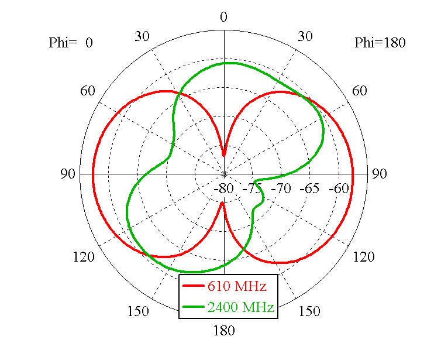{width="85%" height="22vh"}

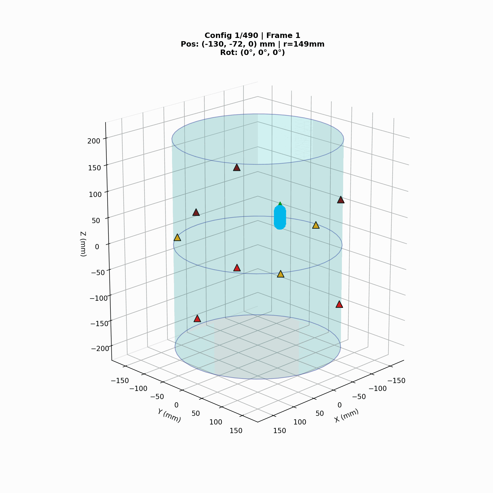{width="85%" height="18vh"}

:::

::: {.column width="31%"}

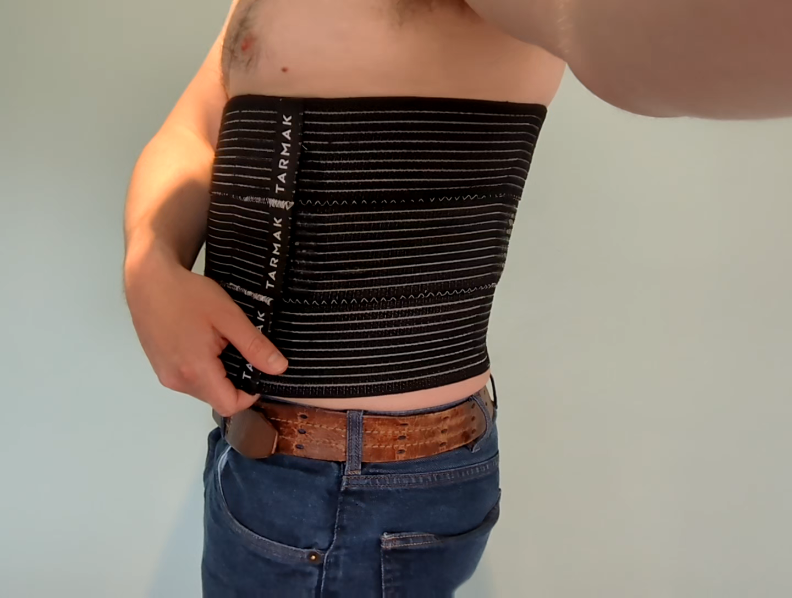{width="65%" height="22vh"}

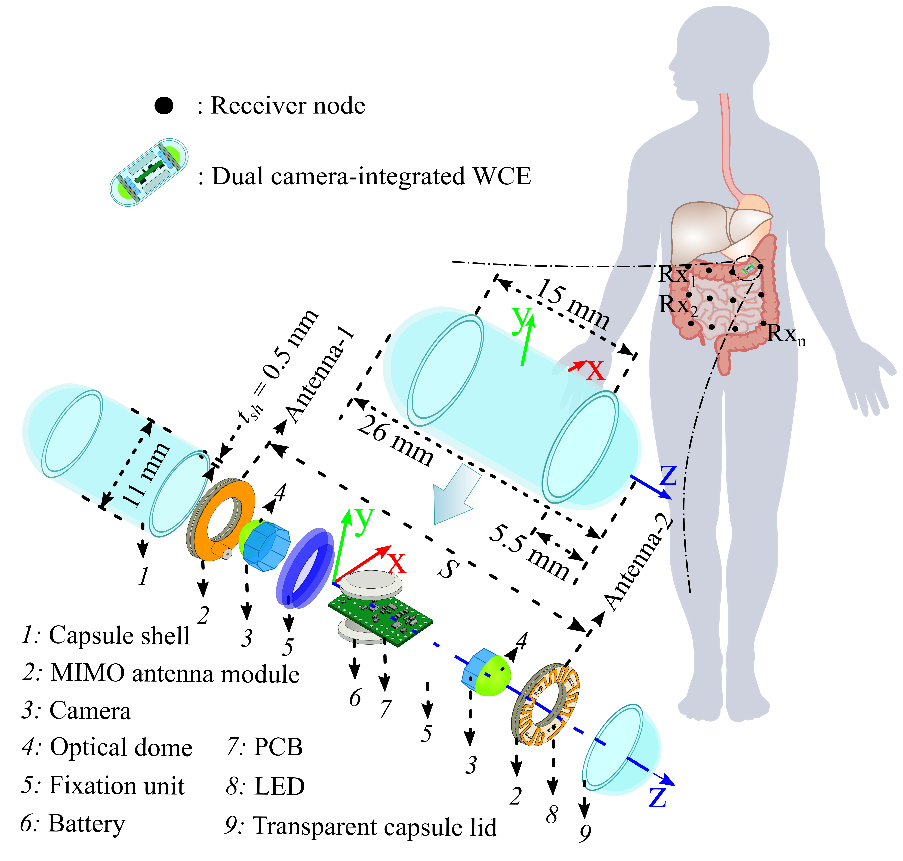{width="85%" height="18vh"}

:::

::::

---

## Antenna Designs and S-Parameters {.smaller}

::: {style="text-align: center;"}

:::

:::: {.columns}

::: {.column width="33%"}

- **(a)** Printed slot antenna — **compact**, wideband MICS + ISM, body-mounted [Qamar 2026]
- Designed for on-body placement with minimal patient discomfort

:::

::: {.column width="33%"}

- **(b)** Offset dipole — **biocompatible** PVC encapsulation, deep-implant propagation [Qamar 2024]
- Dual-camera integrated MIMO design (11 mm × 27 mm)

:::

::: {.column width="34%"}

- **(c)** |S11| < -20 dB at 0.4 GHz, |S22| MICS band matching, |S21| in-body transmission coupling
- Full-wave EM simulation in CST at 403 MHz MICS band

:::

::::

---

## RSSI Distributions Across Anchors {.smaller}

:::: {.columns}

::: {.column width="45%"}

### Per-Anchor Signal Characteristics

- Each anchor exhibits distinct RSSI distribution based on **ring position** and patient geometry
- **Ring-level offsets** reveal systematic path-loss differences with height
- **Spread** within each anchor driven by shadowing, fading, and capsule orientation
- Pairwise RSS differences exploit these offsets for **relative positioning**

### Why This Matters for Localization

- **Ring 1** (blue, top): higher attenuation, wider spread
- **Ring 2** (orange, middle): offset azimuth provides complementary view
- **Ring 3** (green, bottom): strongest signals, narrowest distributions
- These patterns encode **3D position information** that the model learns to decode

:::

::: {.column width="55%"}

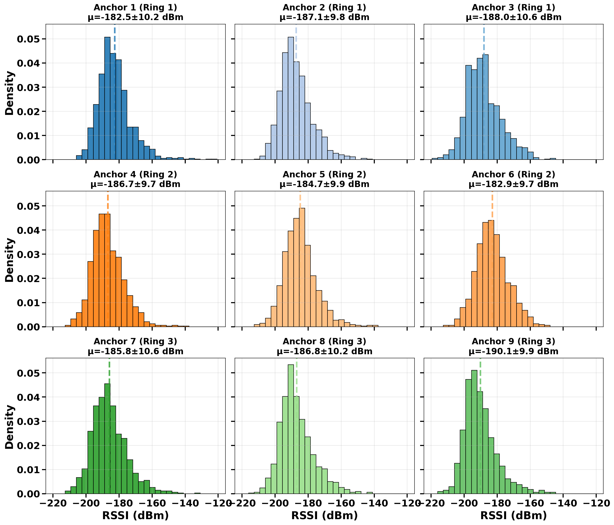{width="100%"}

:::

::::

---

## Anchor-Aware Encoder Architecture {.smaller}

::: {style="text-align: center; display: flex; justify-content: center; align-items: center; height: 85%;"}

:::

---

## Trajectory Error Analysis {.smaller}

:::: {.columns}

::: {.column width="45%"}

### Per-Point Prediction Accuracy

- Error varies along the trajectory depending on **local anchor geometry**
- **Lower error** at mid-height positions where 3 rings provide strongest vertical diversity
- **Higher error** near cylinder top/bottom extremes and close to walls
- Mean error of **1.66 cm** along this representative 10-point path

### What Drives the Variation?

- **Geometric dilution of precision (GDOP)** increases near boundaries
- Capsule orientation creates **anchor-dependent SNR drops** (dipole nulls)
- Mid-cylinder benefits from **symmetric anchor coverage** across all 3 rings
- Stochastic integration captures this **position-dependent uncertainty**

:::

::: {.column width="55%"}

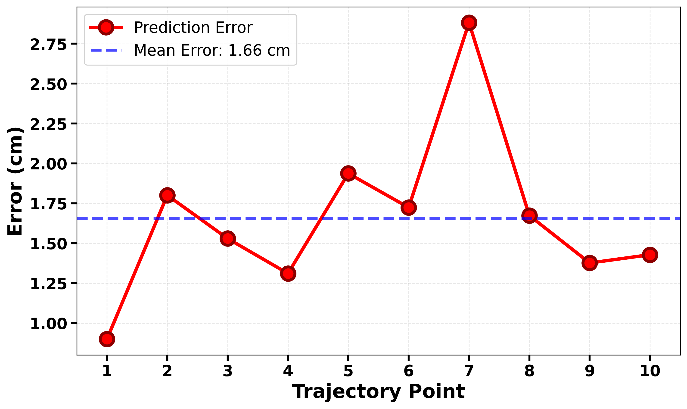{width="100%"}

:::

::::

---

## Results: Overall Performance {.smaller}

::: {style="text-align: center; margin-bottom: 0.4em;"}

:::

:::: {.columns}

::: {.column width="50%"}

### Best Validation (Epoch 149)

<table style="font-size: 0.65em; border-collapse: collapse; width: 100%;">
<tr style="background: #2a76a3; color: white;"><th colspan="2" style="padding: 4px 10px; text-align: left;">Error Metrics</th></tr>
<tr><td style="padding: 3px 10px;">Mean error</td><td style="padding: 3px 10px; font-weight: bold;">1.94 cm (± 0.77)</td></tr>
<tr style="background: #f0f4f8;"><td style="padding: 3px 10px;">Median</td><td style="padding: 3px 10px;">1.88 cm</td></tr>
<tr><td style="padding: 3px 10px;">95th percentile</td><td style="padding: 3px 10px;">3.29 cm</td></tr>
<tr style="background: #27ae60; color: white;"><th colspan="2" style="padding: 4px 10px; text-align: left;">Success Rates</th></tr>
<tr style="background: #f0f4f8;"><td style="padding: 3px 10px;">≤ 1 cm</td><td style="padding: 3px 10px;">17.5%</td></tr>
<tr><td style="padding: 3px 10px;">≤ 2 cm</td><td style="padding: 3px 10px;">71.6%</td></tr>
<tr style="background: #f0f4f8;"><td style="padding: 3px 10px;">≤ 3 cm</td><td style="padding: 3px 10px; font-weight: bold;">97.0%</td></tr>
<tr><td style="padding: 3px 10px; font-weight: bold;">≤ 5 cm</td><td style="padding: 3px 10px; font-weight: bold; color: #27ae60;">100%</td></tr>
<tr style="background: #e67e22; color: white;"><th colspan="2" style="padding: 4px 10px; text-align: left;">Per-Axis MAE (cm)</th></tr>
<tr><td style="padding: 3px 10px;">x / y / z</td><td style="padding: 3px 10px; font-weight: bold;">0.79 / 0.80 / 0.86</td></tr>
</table>

:::

::: {.column width="50%"}

### Key Observations

- **Near-isotropic**: per-axis errors within 0.07 cm of each other
- **100% within 5 cm** clinical threshold, **97%** within 3 cm
- Median **under 2 cm** — sub-cm per-axis accuracy
- UWB methods report 1-4 mm but need specialized hardware; RSSI-only achieves 5-10 cm
- Our CFM: **sub-2 cm with built-in uncertainty** using standard RF features

:::

::::

---

## Robustness: Varying Body Size {.smaller}

:::: {.columns}

::: {.column width="50%"}

### Phantom Diameter Sweep

The model is tested across a range of cylindrical phantom diameters to evaluate robustness to **patient-specific body size variations**.

- Error remains **stable** across diameter range (25-40 cm)
- Slight increase at extremes (smallest/largest phantoms)
- Central trajectory points consistently better localized
- Edge effects near cylinder walls increase error

### Clinical Implication

- A **single trained model** handles diverse patient body sizes
- No per-patient re-training or diameter calibration required
- Gray envelope shows the full distribution across all diameters

:::

::: {.column width="50%"}

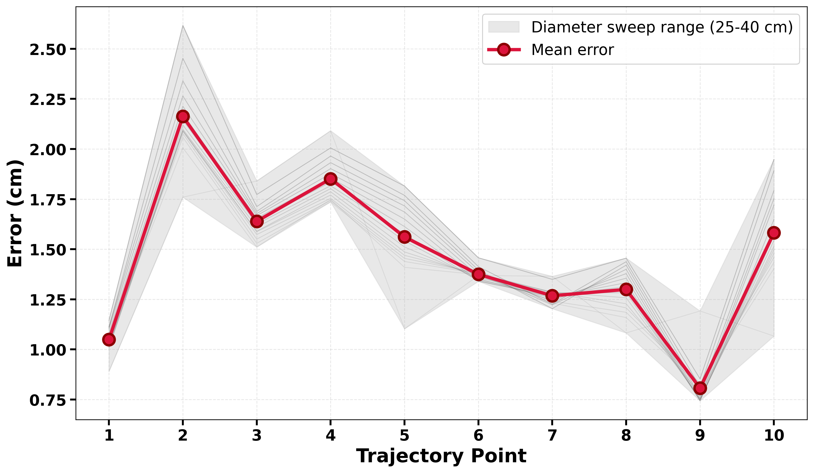{width="95%"}

:::

::::

---

## Robustness: Varying Tissue Properties {.smaller}

:::: {.columns}

::: {.column width="50%"}

### Permittivity Sweep

Tissue permittivity directly affects RF propagation speed, attenuation, and wavelength inside the body.

- Model evaluated across range of permittivity values
- Performance degrades gracefully
- No catastrophic failures at any setting
- Validates that the learned flow generalizes beyond training conditions

### Implications

- Single trained model works across tissue types
- No per-patient re-calibration required
- Heterogeneous tissue (fat, muscle, organs) handled implicitly through the stochastic channel model

:::

::: {.column width="50%"}

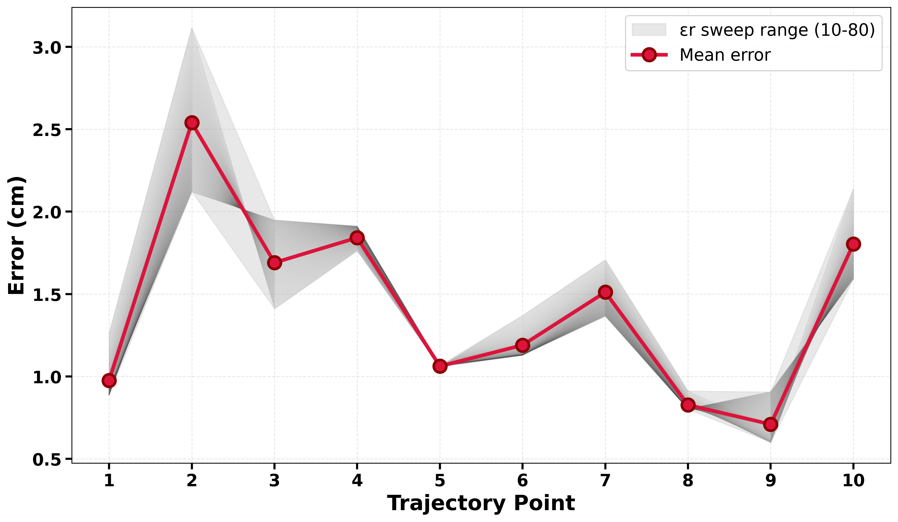{width="95%"}

:::

::::

---

## Spatial Error Analysis {.smaller}

:::: {.columns}

::: {.column width="55%"}

### Where Does the Model Succeed and Fail?

**Lower error regions:**

- Mid-height positions (near ring 2 at 20 cm)
- Three rings provide strongest vertical diversity
- Central positions with good geometric dilution of precision

**Higher error regions:**

- Near cylinder walls (geometric dilution)
- Top/bottom extremes (fewer nearby anchors)
- Positions where capsule dipole nulls align with anchor directions

### Error Sources

- **Orientation-dependent gain**: dipole nulls can depress SNR for subsets of anchors
- **Correlated shadowing**: spatially correlated fading creates local blind spots
- **Pairwise RSS symmetry**: when multiple anchors have similar distance/angle, differential features become less informative

:::

::: {.column width="45%"}

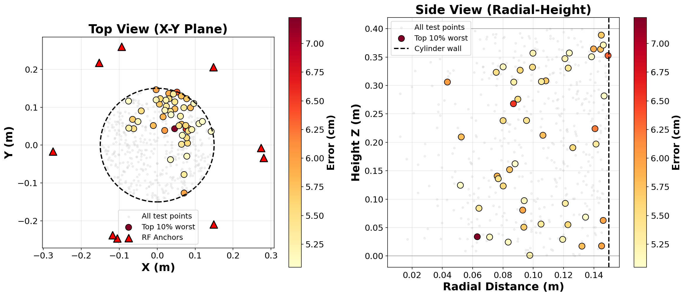{width="95%"}

:::

::::

---

## Key Takeaways {.smaller}

:::: {.columns}

::: {.column width="50%"}

### Technical Contributions

1. **First application of conditional flow matching** to RF-based WCE localization

2. **Anchor-aware architecture** with per-anchor tokens and cross-anchor attention

3. **Geometry-constrained transport** keeping trajectories within the body domain

4. **Heteroscedastic uncertainty** providing calibrated per-axis confidence

5. **Robustness validation** across body sizes and tissue properties

### Results Summary

- **1.94 cm** mean error ($\pm$ 0.77 cm) • **100%** within 5 cm clinical threshold
- **Near-isotropic** per-axis errors (~0.8 cm each) • Robust to body-size and tissue variations

### Future Work

- Validation on **measured phantom** and **in-vivo** data; patient-specific priors and self-calibration
- Extended orientation/antenna modeling; real-time uncertainty-aware decision logic

:::

::: {.column width="50%"}

::: {style="text-align: center;"}
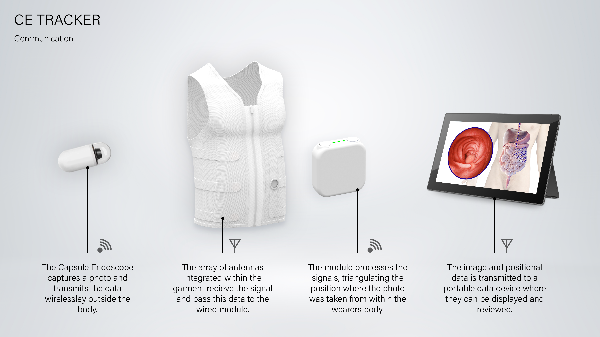
:::

::: {style="text-align: center; font-size: 0.75em; color: #555; margin-top: 0.2em;"}
**CE Tracker Vision — QMUL Antennas Group:** wearable antenna garment → RF triangulation → real-time 3D position alongside capsule imagery for clinical anatomical mapping.
:::

:::

::::

---

## Thank You {.center}

### Questions?

 

**Machine Learning-Based Anchor-Aware Conditional Flow Matching for RF Localization in Wireless Capsule Endoscopy**

 

Subramaniam S. Murugesan, Muhammad Qamar, Kamil Yavuz Kapusuz, Mohamed A. Thaha, Akram Alomainy

 

{s.subramanianmurugesan, m.qamar, m.a.thaha, a.alomainy}@qmul.ac.uk | kamilyavuz.kapusuz@ugent.be
